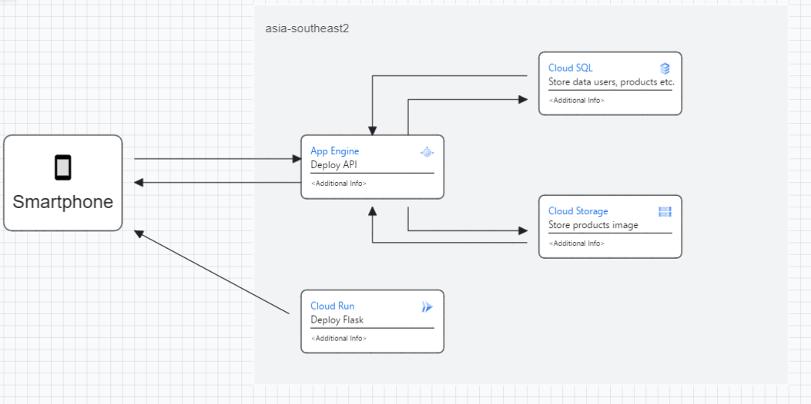

# Documentation
## Architecture



## Cloud SQL Database Structure


## Dependencies

- @hapi/cookie: "^12.0.1",
- @hapi/hapi: "^21.3.9",
- bcrypt: "^5.1.1",
- dotenv: "^16.4.5",
- firebase-admin: "^12.1.1",
- jsonwebtoken: "^9.0.2",
- mysql2: "^3.9.8",
- sequelize: "^6.37.3",
- validator: "^13.12.0"


## Installation

 Requires [Node.js](https://nodejs.org/) v18 or later to run.
1. clone the project
```sh
git clone https://github.com/Modista-Team/Cloud-Computing.git
cd Cloud-Computing
```
2. Install the dependencies

```sh
cd Cloud-Computing
npm i
```

3. Create .env file in root directory project and set the following enviroment variables
```sh
SECRET_KEY=<secret key for JWT>
DB_NAME=<name of database>
DB_USER=<user cloud sql>
DB_PASS=<password cloud sql instance>
DB_HOST=<your host database instance>
DB_PORT=<your port>
```
4. Run application
```sh
npm run start-dev
```

## Recap Endpoints

| Route                        | HTTP Method | Description                     | Auth         |
|------------------------------|-------------|---------------------------------|--------------|
| /login                       | POST        | Log in a user                   | Not Required |
| /loginWithGoogle             | POST        | Log in a user                   | Not Required |
| /register                    | POST        | Register a new user             | Not Required |
| /logout                      | POST        | Log out a user                  | Not Required |
| /users/{user_id}             | GET         | Get user by ID                  | Required     |
| /users/address/{user_id}     | PUT         | Edit user address               | Required     |
| /products                    | GET         | Get all products                | Required     |
| /products/{product_id}       | GET         | Get product details by ID       | Required     |
| /search                      | GET         | Search products                 | Required     |
| /cart/{user_id}              | GET         | Get cart by user ID             | Required     |
| /cart/add                    | POST        | Add data to cart                | Required     |
| /cart/update/{cart_id}       | PUT         | Update cart                     | Required     |
| /cart/delete/{cart_id}       | DELETE      | Delete cart                     | Required     |
| /orders/add/{user_id}        | POST        | Create order                    | Required     |
| /orders/user/{user_id}       | GET         | Get all user orders             | Required     |
| /orders/{order_id}           | GET         | Get specific order by ID        | Required     |

## Documentation

[API Documentation](documentation/endpoint.md)

